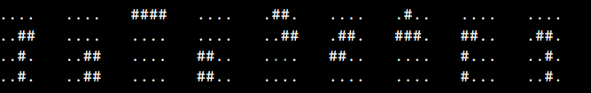
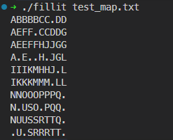

# Fillit

The goal of this project is to arrange every Tetriminos with each others in order to make
the smallest possible square.  
A tetriminos is a shape made of 4 squares, often found in the game Tetris. Example:  

  
The program must display the smallest possible square on the standard output.  
Each Tetrimino in the square solution will have a capital letter assigned to them
starting with 'A' and increasing for each new Tetrimino.  

Example output:  

